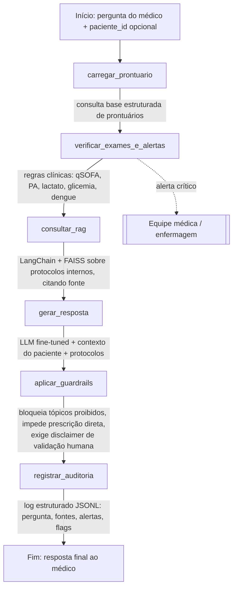

# Diagrama do fluxo — Assistente Médico (LangGraph)

## Descrição das etapas

| Nó | Responsabilidade | Módulo |
|---|---|---|
| `carregar_prontuario` | Consulta a base estruturada de prontuários (mock) do paciente informado | `src/rag/patient_db.py` |
| `verificar_exames_e_alertas` | Aplica regras clínicas dos protocolos (qSOFA, PA, lactato, glicemia, dengue) e gera alertas para a equipe | `src/agent/clinical_rules.py` |
| `consultar_rag` | Recupera trechos relevantes dos protocolos internos via LangChain + FAISS, combinando a pergunta com a hipótese diagnóstica/alertas do paciente | `src/rag/retriever.py` |
| `gerar_resposta` | Gera a resposta com o LLM fine-tuned, usando prontuário + alertas + protocolos como contexto | `src/agent/llm_client.py` |
| `aplicar_guardrails` | Bloqueia tópicos proibidos, sinaliza linguagem de prescrição direta e garante o disclaimer de validação humana | `src/security/guardrails.py` |
| `registrar_auditoria` | Grava o evento completo (pergunta, fontes citadas, alertas, flags de guardrail) em log estruturado para auditoria | `src/security/audit_log.py` |
